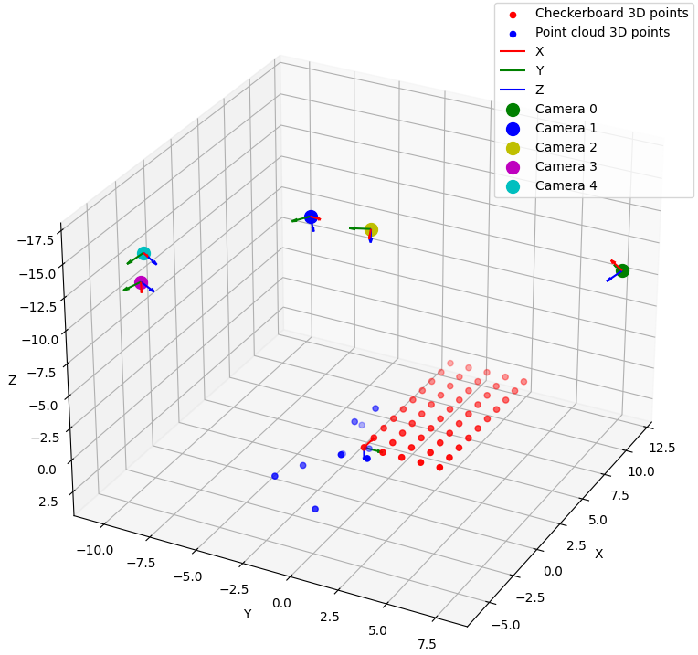

# Problem Description

There is a camera, a checkerboard, and a point cloud in your environment.

The camera images the checkerboard and point cloud from 5 perspectives.  

Camera = focal length 200, principle-point = (0,0) and no distortion

Checkerboard = 1 m x 1 m in dimensions. Has 50 corners on it.

Point cloud = is positioned in the environment.

The zip file contains each image generated by the camera.

3D point index, X pixel coordinate, Y pixel coordinate = is the format of each image text file.

0-49 point indices correspond to the checkerboard.

All images have gaussian noise.  

You need to find the best possible 3D estimates of the points in the point cloud.

# Code  
1. Minimal dependencies:  
    2. Numpy, `numpy`    
    3. OpenCV, `cv2`  
    4. Scipy, `scipy`  
    5. Matplotlib, `matplotlib` 

2. Run python files in the following order:
    1. `python linear_sol.py`  
    2. `python bundle_adjustment.py`  

# Results
1. Problem Statement, Methodology, and Results can be found in the [report](report/main.pdf).

